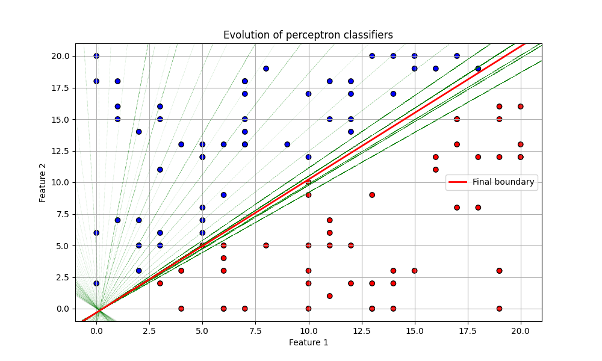

# Perceptron algorithm
***
## *About project*
Skill-demonstration project where I create a perceptron algorithm that works by **SGD** *(Stochastic gradient descent)*
***
## Technology Stack:
### **1. Core Technologies**  
- **Python** (version 3.8+):  
  - Primary language for implementing the algorithm and visualization.  
- **NumPy**:  
  - Handling arrays and vectorized operations for perceptron computations.  

---

### **2. Visualization**  
- **Matplotlib**:  
  - Plotting decision boundaries, data points, and training dynamics.  
- **Seaborn** (optional):  
  - Enhancing plot aesthetics (grids, color palettes).  

---

### **3. Algorithms & Math**  
- **Custom Perceptron Implementation**:  
  - Building the learning algorithm from scratch *(without libraries like scikit-learn)*.  
- **Metrics**:  
  - Custom functions for error calculation.  

---

### **4. Development Tools**  
- **Jupyter Notebook**:  
  - Interactive environment for prototyping and visualization.  
- **PyCharm**:  
  - Structured code development and version control integration.  

---

### **5. Version Control System**  
- **Git + GitHub**:  
  - Code hosting, commit history, and branching.  

---

### **6. Dependency Management**  
- **Pip**:  
  - Installing libraries (NumPy, Matplotlib) and managing virtual environments.  
- **requirements.txt**:  
  - Dependency list for reproducibility.  

---

### **7. Documentation**  
- **Markdown**:  
  Project description, goals, and results in `README.md`.

--- 

<details>
<summary><b>Tap to see visualization of training process</b></summary>

**Perceptron training evolution**

**Error-function training evolution**
 

</details>

### **Project Structure**  
```bash
Rerceptron_algorithm/
├── Perceptron_algorithm.ipynb   # Jupyter notebooks with algorithm
├── pictures/                    # Folder for visualization
├── requirements.txt             # Dependency list
└── README.md                    # Project overview
